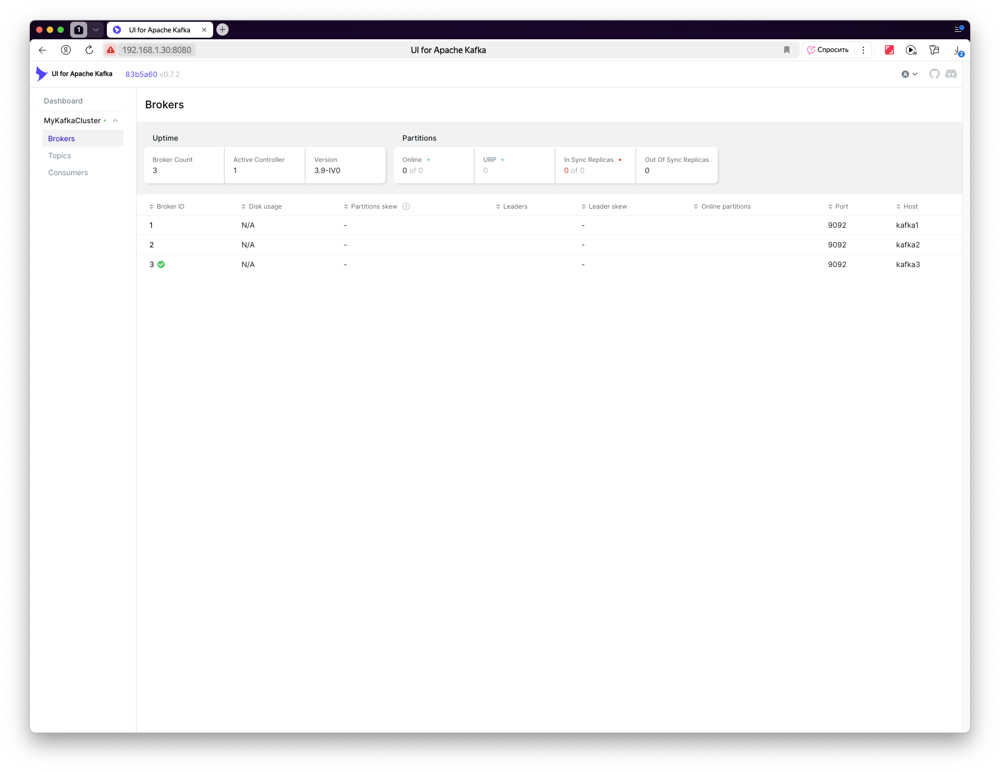

# 🛰️ Apache Kafka Cluster (KRaft Mode) — 3-брокерный кластер + Kafka UI


> 💡 Современная конфигурация Apache Kafka **без Zookeeper**, в **режиме KRaft**, работающая на трёх виртуальных машинах (Ubuntu Server 24.04) через Docker.

---

## 📸 Интерфейс Kafka UI



---

## ⚙️ Состав проекта

- 🐳 **Kafka Brokers (3)** — отдельные контейнеры:
  - `kafka1:kraft` — IP `192.168.1.27`
  - `kafka2:kraft` — IP `192.168.1.28`
  - `kafka3:kraft` — IP `192.168.1.29`
- 📊 **Kafka UI** — Web-интерфейс на порту `8080`
- 📦 **KRaft Mode** — Kafka без Zookeeper
- 🔐 **CLUSTER_ID**: `LkBVjBndQtGdoUoDuO8sug`
- 📁 **Лог-директория брокеров**: `/var/lib/kafka/logs`
- 🛡️ **Сеть Docker**: `kafka-networkname`

---

## 🧰 Как запустить кластер

### 1. 🏗️ Собери образы брокеров

```bash
cd node1 && docker build -t kafka1:kraft .
cd ../node2 && docker build -t kafka2:kraft .
cd ../node3 && docker build -t kafka3:kraft .
cd ..

### 2. 🚀 Запусти весь кластер

docker compose up -d

### 3. 🌐 Перейди в интерфейс Kafka UI

http://localhost:8080

## 🛠️ Конфигурация docker-compose.yml

services:
  kafka1:
    image: confluentinc/cp-kafka:latest
    container_name: kafka1
    hostname: kafka1
    ports:
      - "19091:9092"
    volumes:
      - kafka1-data:/var/lib/kafka/data
    networks:
      kafka-network:
        ipv4_address: 192.168.110.11
    environment:
      KAFKA_NODE_ID: 1
      KAFKA_PROCESS_ROLES: broker,controller
      KAFKA_CONTROLLER_QUORUM_VOTERS: 1@kafka1:9093,2@kafka2:9093,3@kafka3:9093
      KAFKA_LISTENERS: PLAINTEXT://0.0.0.0:9092,CONTROLLER://0.0.0.0:9093
      KAFKA_ADVERTISED_LISTENERS: PLAINTEXT://kafka1:9092
      KAFKA_CONTROLLER_LISTENER_NAMES: CONTROLLER
      KAFKA_LISTENER_SECURITY_PROTOCOL_MAP: CONTROLLER:PLAINTEXT,PLAINTEXT:PLAINTEXT
      CLUSTER_ID: LkBVjBndQtGdoUoDuO8sug
      KAFKA_OFFSETS_TOPIC_REPLICATION_FACTOR: 3
      KAFKA_TRANSACTION_STATE_LOG_REPLICATION_FACTOR: 3
      KAFKA_TRANSACTION_STATE_LOG_MIN_ISR: 2
    healthcheck:
      test: ["CMD-SHELL", "kafka-topics --bootstrap-server localhost:9092 --list || exit 1"]
      interval: 30s
      timeout: 10s
      retries: 5
      start_period: 30s

  kafka2:
    image: confluentinc/cp-kafka:latest
    container_name: kafka2
    hostname: kafka2
    ports:
      - "19092:9092"
    volumes:
      - kafka2-data:/var/lib/kafka/data
    networks:
      kafka-network:
        ipv4_address: 192.168.110.12
    environment:
      KAFKA_NODE_ID: 2
      KAFKA_PROCESS_ROLES: broker,controller
      KAFKA_CONTROLLER_QUORUM_VOTERS: 1@kafka1:9093,2@kafka2:9093,3@kafka3:9093
      KAFKA_LISTENERS: PLAINTEXT://0.0.0.0:9092,CONTROLLER://0.0.0.0:9093
      KAFKA_ADVERTISED_LISTENERS: PLAINTEXT://kafka2:9092
      KAFKA_CONTROLLER_LISTENER_NAMES: CONTROLLER
      KAFKA_LISTENER_SECURITY_PROTOCOL_MAP: CONTROLLER:PLAINTEXT,PLAINTEXT:PLAINTEXT
      CLUSTER_ID: LkBVjBndQtGdoUoDuO8sug
      KAFKA_OFFSETS_TOPIC_REPLICATION_FACTOR: 3
      KAFKA_TRANSACTION_STATE_LOG_REPLICATION_FACTOR: 3
      KAFKA_TRANSACTION_STATE_LOG_MIN_ISR: 2
    healthcheck:
      test: ["CMD-SHELL", "kafka-topics --bootstrap-server localhost:9092 --list || exit 1"]
      interval: 30s
      timeout: 10s
      retries: 5
      start_period: 30s

  kafka3:
    image: confluentinc/cp-kafka:latest
    container_name: kafka3
    hostname: kafka3
    ports:
      - "19093:9092"
    volumes:
      - kafka3-data:/var/lib/kafka/data
    networks:
      kafka-network:
        ipv4_address: 192.168.110.13
    environment:
      KAFKA_NODE_ID: 3
      KAFKA_PROCESS_ROLES: broker,controller
      KAFKA_CONTROLLER_QUORUM_VOTERS: 1@kafka1:9093,2@kafka2:9093,3@kafka3:9093
      KAFKA_LISTENERS: PLAINTEXT://0.0.0.0:9092,CONTROLLER://0.0.0.0:9093
      KAFKA_ADVERTISED_LISTENERS: PLAINTEXT://kafka3:9092
      KAFKA_CONTROLLER_LISTENER_NAMES: CONTROLLER
      KAFKA_LISTENER_SECURITY_PROTOCOL_MAP: CONTROLLER:PLAINTEXT,PLAINTEXT:PLAINTEXT
      CLUSTER_ID: LkBVjBndQtGdoUoDuO8sug
      KAFKA_OFFSETS_TOPIC_REPLICATION_FACTOR: 3
      KAFKA_TRANSACTION_STATE_LOG_REPLICATION_FACTOR: 3
      KAFKA_TRANSACTION_STATE_LOG_MIN_ISR: 2
    healthcheck:
      test: ["CMD-SHELL", "kafka-topics --bootstrap-server localhost:9092 --list || exit 1"]
      interval: 30s
      timeout: 10s
      retries: 5
      start_period: 30s

  kafka-ui:
    image: provectuslabs/kafka-ui:latest
    container_name: kafka-ui
    ports:
      - "8080:8080"
    environment:
      - KAFKA_CLUSTERS_0_NAME=MyKafkaCluster
      - KAFKA_CLUSTERS_0_BOOTSTRAPSERVERS=kafka1:9092,kafka2:9092,kafka3:9092
    networks:
      - kafka-network
    depends_on:
      kafka1:
        condition: service_healthy
      kafka2:
        condition: service_healthy
      kafka3:
        condition: service_healthy

volumes:
  kafka1-data:
  kafka2-data:
  kafka3-data:

networks:
  kafka-network:
    driver: bridge
    ipam:
      config:
        - subnet: 192.168.110.0/24

## 📁 Структура проекта

kafka-cluster/
├── docker-compose.yml
├── README.md
├── kafka-ui.png
├── node1/
│   ├── Dockerfile
│   └── server.properties
├── node2/
│   ├── Dockerfile
│   └── server.properties
├── node3/
│   ├── Dockerfile
│   └── server.properties

## 🔧 Команды управления Kafka

   ➕ Создать топик

docker exec -it kafka1 kafka-topics.sh \
  --create \
  --topic test-topic \
  --bootstrap-server 192.168.1.27:9092 \
  --partitions 1 \
  --replication-factor 3

   📜 Список топиков

docker exec -it kafka2 kafka-topics.sh \
  --list \
  --bootstrap-server 192.168.1.28:9092

## 📌 Примечания

Используется confluentinc/cp-kafka:7.9.0 (KRaft-enabled)

Все настройки лежат в server.properties внутри nodeX/

Для портов выбраны значения 19091, 19092, 19093 — чтобы избежать конфликтов

## 📄 Licens

MIT License
